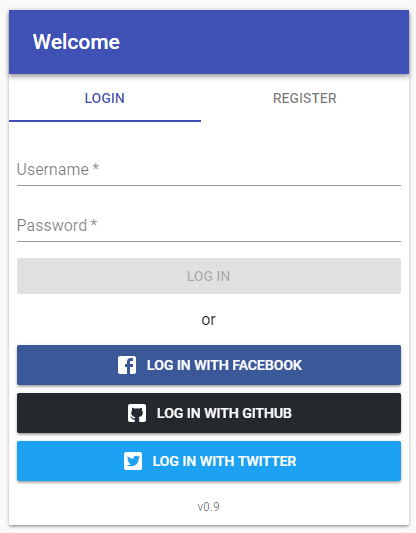
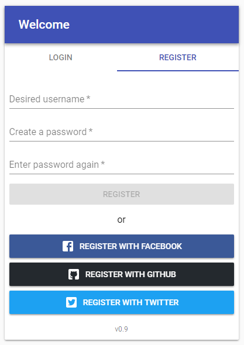

[](https://circleci.com/gh/itzg/react-mui-login-register/tree/master)
[](https://www.npmjs.com/package/react-mui-login-register)
[](https://react-mui-login-register.surge.sh/)
[](https://github.com/itzg/react-mui-login-register)

This is a user login/register React component that includes options to use an authentication provider.
It is styled in Material Design using [Material UI](https://material-ui-next.com/)
and the forms are powered by [Formsy](https://github.com/formsy/formsy-react).

## Screenshots





## Interactive Demo/Editor

[Demo of latest release](https://react-mui-login-register.surge.sh/)

[](https://codesandbox.io/s/cold-sound-0fxqs?fontsize=14)

## Install

```
yarn add react-mui-login-register
```

or

```
npm i --save react-mui-login-register
```

## Quick Start

This is example of using the 

```javascript
import LoginRegister from 'react-mui-login-register';


class Demo extends Component {
  render() {

    const header = (
        <AppBar position="static">
          <Toolbar>
            <Typography variant="title" color="inherit">Welcome</Typography>
          </Toolbar>
        </AppBar>
    );

    const footer = (
        <div className={classes.footer}>
          <Typography variant="caption" align="center">v0.9</Typography>
        </div>
    );

    return (
        <div>
          <LoginRegister header={header} footer={footer}
                         onLogin={this.handleLogin}
                         onLoginWithProvider={this.handleLoginWithProvider}
                         onRegister={this.handleRegister}
                         onRegisterWithProvider={this.handleRegisterWithProvider}
          />
        </div>);
  }

  handleLogin = content => {
    alert(`Logging in with content '${JSON.stringify(content)}'`);
  };

  handleLoginWithProvider = providerId => {
    alert(`Logging in with provider '${providerId}'`);
  };

  handleRegister = content => {
    alert(`Registering with content '${JSON.stringify(content)}'`);
  };

  handleRegisterWithProvider = providerId => {
    alert(`Registering with provider '${providerId}'`);
  };
}

```
